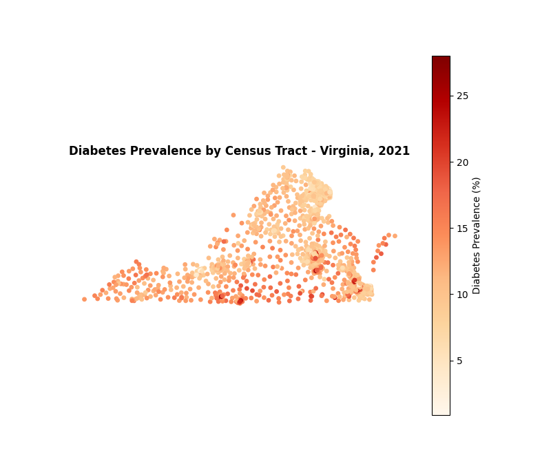
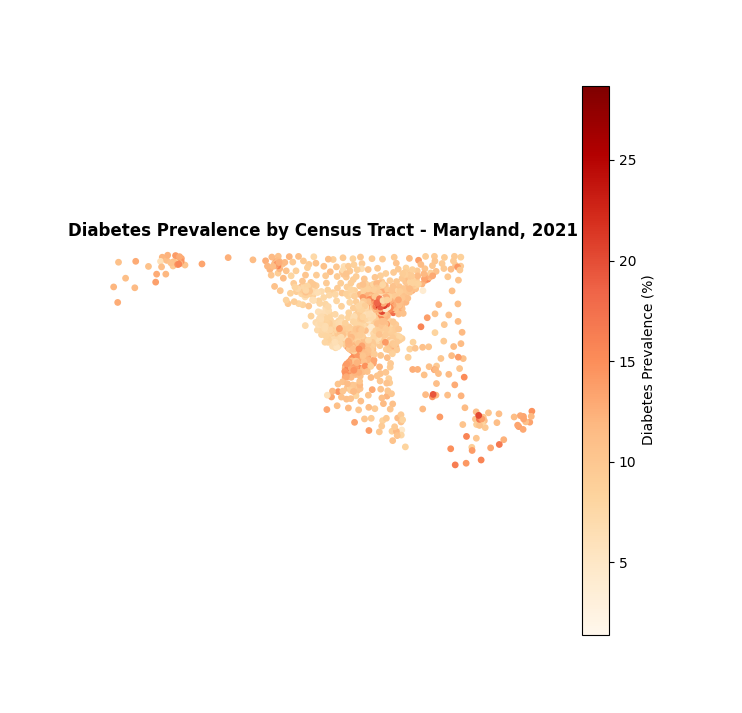
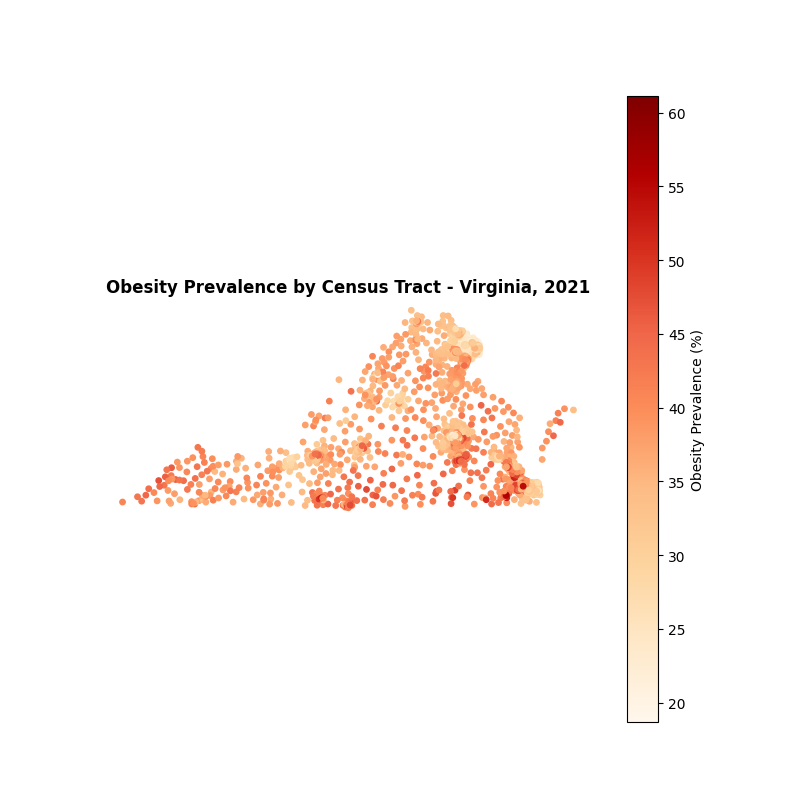
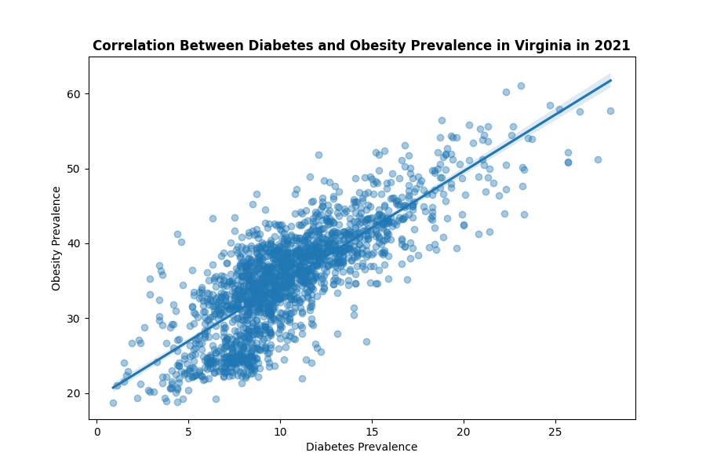
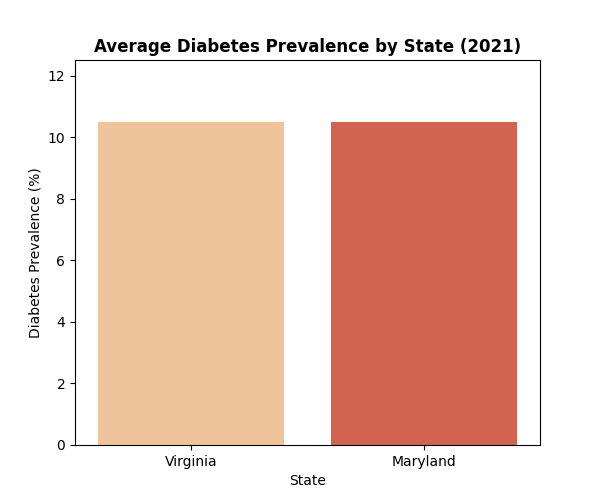
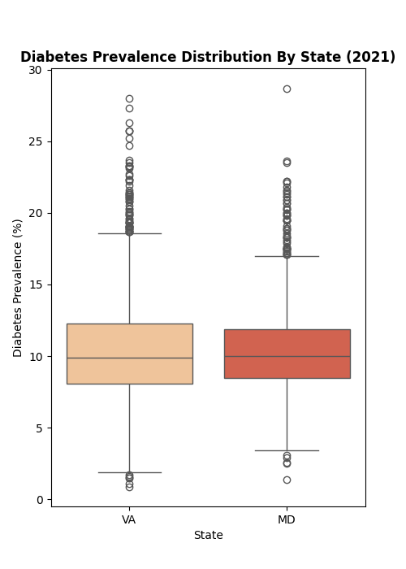

# Diabetes & Obesity Geospatial Analysis

## Technology Used

- **Python 3**
- **Pandas**
- **GeoPandas / Shapely**
- **Seaborn / Matplotlib**
- **Requests library**
- **CDC Socrata Open Data API**

**Implementation:** Built a program that pulls live diabetes and obesity prevalence data directly from CDC's public API, maps it, and compares prevalence between Virginia and Maryland.

## Data Source

[PLACES: Local Data for Better Health, Census Tract Data (2023 release)](https://data.cdc.gov/500-Cities-Places/PLACES-Local-Data-for-Better-Health-Census-Tract-D/em5e-5hvn) — pulled directly via CDC's Socrata API (`data.cdc.gov/resource/em5e-5hvn.json`). Scoped to Virginia and Maryland, diabetes and obesity measures — see Data Quality Notes below for why this specific dataset identifier was used.

## Maps

**Diabetes Prevalence by Census Tract — Virginia, 2021**



**Diabetes Prevalence by Census Tract — Maryland, 2021**



**Obesity Prevalence by Census Tract — Virginia, 2021**



## Key Implementations

- **Live API Pull:** Queried CDC's SODA API with `requests`, filtering by state (`stateabbr`) and measure (`measureid`) directly in the URL, and converted the JSON response into a pandas DataFrame.
- **Coordinate Extraction:** Isolated latitude/longitude out of the nested `geolocation` dictionary returned by the API, using `isinstance()` to skip missing or faulty entries.
- **Geospatial Mapping:** Built `GeoDataFrame`s with `geopandas` to map diabetes and obesity prevalence by census tract.
- **Multi-Dataset Merge:** Joined diabetes and obesity data on `locationid`, trimming each source DataFrame to its essential columns first to avoid duplicate or conflicting column names on merge.
- **Correlation & Distribution Comparison:** Calculated a Pearson correlation between diabetes and obesity prevalence, and used `seaborn` box plots to compare the full distribution of tract-level rates between Virginia and Maryland, not just the averages.

## Data Quality Notes

Real government data required some digging before the results could be trusted:

- **Dataset link instability:** The original Socrata identifier used was found to reroute to a newer data release over time rather than staying fixed to one dataset version. I switched to the permanently archived 2023 release identifier (`em5e-5hvn`) used above to ensure consistent, reproducible results.
- **Release year vs. survey year:** A PLACES "release year" reflects when CDC published the dataset, not when the underlying survey data was collected. The 2023 release used here is built mostly from 2021 BRFSS survey responses, which is why the analysis is described as 2021 data.
- **Location verification:** Census tracts are identified by FIPS code rather than city name. I verified that all Maryland records carried the `24` state FIPS prefix before trusting the Maryland results, ruling out a mixed-up data pull.
- These findings shaped the choice of dataset identifier and the final year framing used throughout the analysis.

## Key Findings

- Diabetes and obesity prevalence were positively correlated at the census tract level in Virginia in 2021, with a Pearson correlation coefficient of **0.79**.



- Virginia and Maryland had nearly identical average diabetes prevalence in 2021 — **10.51%** for both states, a difference of less than 0.01 percentage points — a result that was verified against a possible data-pulling error before being reported.



- Despite the near-identical averages, a box plot comparison shows Virginia has a wider spread of tract-level diabetes rates than Maryland, including more low-prevalence outlier tracts.



## Requirements

```
pandas
geopandas
shapely
seaborn
matplotlib
requests
```

## Limitations

- Averages are simple (unweighted) tract-level averages, not population-weighted state prevalence rates.
- Analysis is limited to Virginia and Maryland; it does not reflect patterns across other states or the United States as a whole.
- Some census tracts are missing from the source data where CDC suppressed estimates due to insufficient survey sample size.
